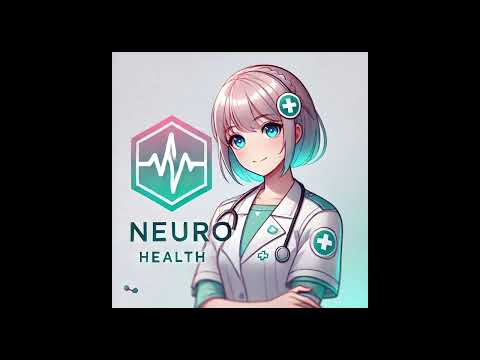
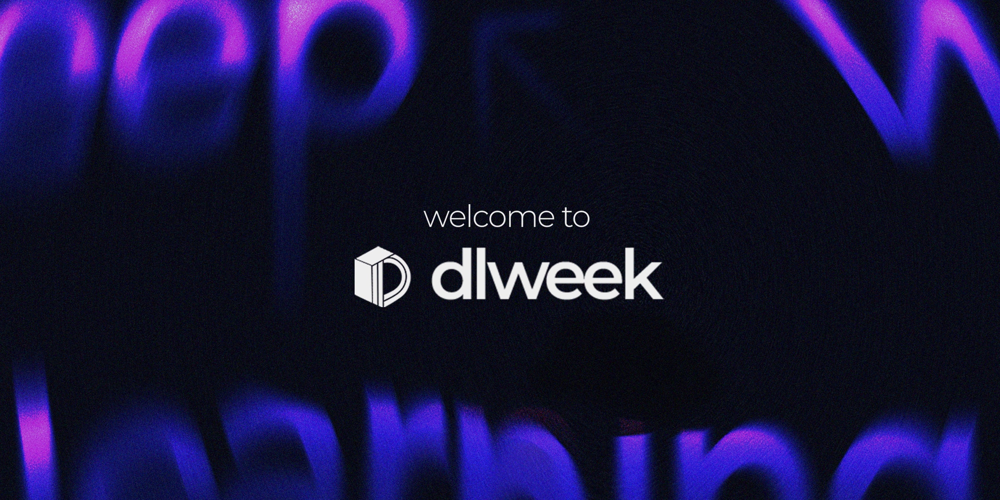

# Neuro owo: AI-based Application for Personalized Health Management

## Introduction

Imagine having your very own AI coach that not only tracks your workouts, but also helps you train smarter, move better, and stay healthier—that’s **Neuro owo**! In today’s hectic world, keeping up with your fitness and nutrition can be a real challenge. Neuro owo makes it effortless by combining **cutting-edge AI**, **pose estimation**, and **personalized coaching** to optimize your workouts and diet.

Powered by the **YOLO v11 pose estimation model**, Neuro owo analyzes your movements with **82% accuracy**, giving you real-time corrections for push-ups, pull-ups, and other postures—so you see better results with fewer injuries. But that’s not all! Using **DeepSeek AI**, our app learns from your training history to create **weekly workout and diet plans** tailored to your individual needs. Whether you’re brand-new to fitness or a seasoned athlete, this AI assistant adapts to push you toward your best self.

Getting started is simple: if you haven’t used Neuro owo before, you’ll first fill in some basic body data to personalize your experience. Next, you can sync your past workout data from any compatible smart device. When you’re ready to exercise, just open the **camera**, and the app will automatically detect your exercise type, making sure you maintain the correct form. Perfect form counts toward your totals; if something’s off, the app gently prompts you to adjust. Want an even better plan for the coming week? **DeepSeek** will use your exercise history, real-time data, and its built-in **LLM** to craft a tailored program that helps you keep improving.

Train smarter, move better, and take control of your health with **Neuro owo**—your personal AI fitness coach!

### **YouTube Introduction**

[](https://www.youtube.com/watch?v=nRGR58uyMOo)


### Competition Introduction

This project is part of **Deep Learning Week 2025**, a competition organized by **MLDA@EEE, Micron, Google, AWS, DoraHacks, NVIDIA, and JaneStreet**. You can learn more about the event and join the competition via the following links:

- **Competition Link**: https://dorahacks.io/hackathon/dlweek2025/buidl
- **Event Introduction**: https://www.dlweek.com/



## Table of Contents

1. [Project Overview](#project-overview)
2. [Features](#features)
3. [Repository Structure](#repository-structure)
4. [Installation and Setup](#installation-and-setup)
5. Usage
   - [1. Streamlit GUI (Deepseek Interface)](#1-streamlit-gui-deepseek-interface)
   - [2. YOLO11-pose Scripts](#2-yolo11-pose-scripts)
6. [License](#license)
7. [Contributing](#contributing)
8. [Contact](#contact)


## Project Overview

**Neuro owo** is an AI assistant that enables users to:

- Track and analyze multidimensional health data (physiological, behavioral, psychological).
- Receive personalized workout routines, nutrition tips, and mental health interventions.
- Benefit from pose estimation and exercise correction through computer-vision–based feedback.
- Access a secure hybrid storage architecture balancing privacy and performance.

**Key highlights**:

- **Pose Estimation**: Uses a custom YOLO11-pose model fine-tuned on datasets like [HSiPu2](https://github.com/mindayao/HSiPu2).
- **Reinforcement Learning**: Continuously adapts health plans using user feedback.
- **Privacy Compliance**: Employs differential privacy and hybrid (local + cloud) data storage to meet healthcare regulations (e.g., HIPAA, GDPR).

## Features

1. **Personalized Exercise Guidance**
   - Real-time posture detection and corrections using YOLO11-pose.
   - Automated workout counting and form checks.
   - Voice and video recommendations for proper technique.
2. **Health Data Management**
   - Tracks daily metrics such as weight, calorie intake, blood pressure, etc.
   - Hybrid local–cloud solution ensures scalable data storage while protecting privacy.
3. **Mental Wellness Monitoring**
   - Multimodal emotion recognition (facial expressions, text, and audio).
   - Tiered intervention framework for mental health support.
4. **Integration with Wearables**
   - Planned support for retrieving real-time heart rate, sleep data, and more from smart watches or fitness bands.
5. **Adaptive Recommendations**
   - Machine learning–driven reinforcement to personalize suggestions, workout intensities, and meal plans over time.

## Repository Structure

Below is a brief overview of the main folders and files:

```
.
├─ .gitattributes
├─ .gitignore
├─ LICENSE
├─ README.md
├─ logo/
│  └─ logo.png                  # Project logo
├─ paper/
│  └─ Neuro owo an AI-based application for personalized health management.pdf
│                              # Research paper detailing the system's design and results
├─ ppt/
│  └─ Neuro-owo-AI-Powered-Personalized-Health-Management-final.pptx
│                              # Presentation slides 
└─ src/
   ├─ deepseek_GUI_Streamlit/
   │  ├─ configs.py
   │  ├─ llm.py
   │  ├─ logo.png
   │  ├─ requirements.txt
   │  └─ stream2.py             # Streamlit-based GUI for demonstration
   └─ Yolo11-pose/
      ├─ camera.py
      ├─ classifier.py
      ├─ clf_dataset.py
      ├─ file_utils.py
      ├─ generate_dataset.py
      ├─ movement_visualization.py
      ├─ pose.csv
      ├─ pose_classifier_high_acc.pth
      ├─ predict.py
      ├─ train.py
      ├─ yolo11m-pose.onnx
      ├─ yolo11m-pose.pt
      └─ dataset/
         └─ dataset.zip         # Dataset for training/evaluation
```

------

## Installation and Setup

1. **Clone the repository**

   ```bash
   git clone https://github.com/freshman2233/Neuro-owo.git
   cd Neuro-owo
   ```

2. **Set up a virtual environment (optional but recommended)**

   ```bash
   python -m venv venv
   source venv/bin/activate   # On Linux/Mac
   venv\Scripts\activate      # On Windows
   ```

3. **Install dependencies**

   - For the Streamlit GUI and other modules:

     ```bash
     cd src/deepseek_GUI_Streamlit
     pip install -r requirements.txt
     ```

   - For the YOLO11-pose tools (if you plan to train or run pose estimation locally):

     ```bash
     cd ../Yolo11-pose
     pip install -r requirements.txt
     ```

     (You may also require additional libraries for deep learning, e.g., `torch` or `tensorflow`, depending on your setup.)

4. **(Optional) Download/prepare dataset**

   - By default, the sample dataset is in 

     ```
     src/Yolo11-pose/dataset/dataset.zip
     ```

     . Unzip it to begin training or inference on custom data:

     ```bash
     unzip dataset.zip
     ```

## Usage

### 1. Streamlit GUI (Deepseek Interface)

This app provides a user-friendly interface to demonstrate some of Neuro owo’s capabilities.

1. Navigate to the Streamlit folder:

   ```bash
   cd src/deepseek_GUI_Streamlit
   ```

2. Run the Streamlit application:

   ```bash
   streamlit run stream2.py
   ```

3. In your browser, access the local URL (e.g., `http://localhost:8501`) to try out the interactive health management features.

### 2. YOLO11-pose Scripts

The `Yolo11-pose` folder contains scripts for training and running the custom YOLO pose estimation model.

- Train a pose model

  ```bash
  python train.py --data_path <path_to_dataset> --epochs 50
  ```

- Run inference

  ```bash
  python predict.py --source <video_or_image_source> --weights yolo11m-pose.pt
  ```

- Movement visualization & classification

  - Use `movement_visualization.py` to generate visual overlays of detected poses.
  - Use `classifier.py` to classify correct vs. incorrect exercise form.

## License

This repository is licensed under the MIT License. You are free to use, modify, and distribute this software as outlined in the license terms.

## Contributing

We welcome contributions of any kind—whether it’s bug reports, new features, or improved documentation. To contribute:

1. Fork the repository.
2. Create a new branch: `git checkout -b feature/YourFeature`.
3. Commit changes: `git commit -m "Add your feature"`.
4. Push to your branch: `git push origin feature/YourFeature`.
5. Create a Pull Request on GitHub.


## Contact

We are a dedicated group of researchers and developers united by a shared vision: to leverage cutting-edge AI technologies for empowering personal health and wellness. Neuro owo is the result of our combined expertise in machine learning, computer vision, and natural language processing.

If you have any questions, suggestions, or feedback, feel free to open an issue or reach out:

- **Lead Developer**: Li Zongze, Cheng Jingxuan, Zhang Zhaoxiang
- **Email**: li0005ze@e.ntu.edu.sg, jinxuan003@e.ntu.edu.sg,  zhaoxian001@e.ntu.edu.sg

We hope you find **Neuro owo** helpful for building AI-powered health applications. Happy coding and stay healthy!


